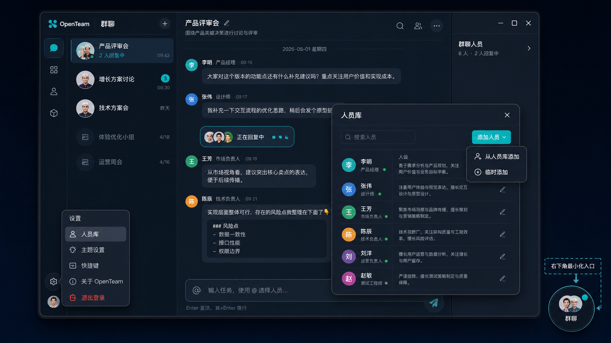
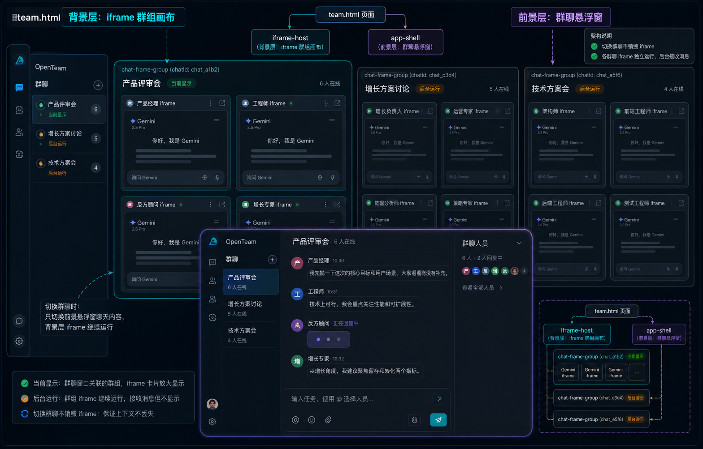
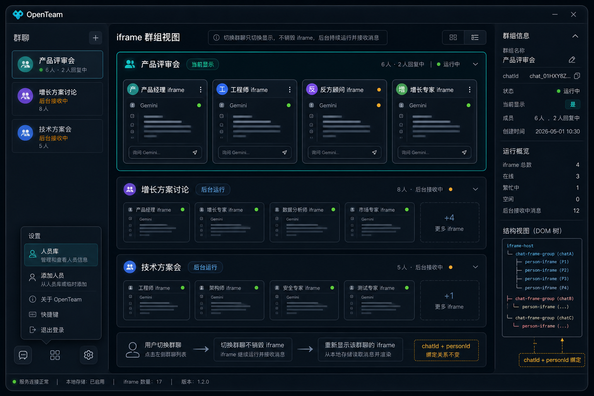

# OpenTeam 群聊体验重构 PRD

## 0. 设计概念图



这张设计概念图用于给后续实现者提供页面方向参考：主界面是暗色悬浮群聊工作台，左侧保留群聊列表和设置入口，中间聚焦消息流，右侧“群聊人员”默认收起；设置齿轮先打开小菜单，再进入人员库弹窗；人员库弹窗支持从人员库添加和临时添加；消息流中展示正在回复动态气泡；缩小态使用右下角圆形悬浮入口。

## 1. 背景

OpenTeam 已经具备基础群聊能力：用户可以创建群聊、添加角色、向多个 Gemini iframe 投递消息，并把回复汇总到统一消息流中。当前实现证明了技术路线可行，但产品体验仍偏“配置工具”，没有完全像一个真实群聊。

本轮迭代目标是把 OpenTeam 从“多角色控制台”推进到“AI 群聊工作台”。用户应该感受到自己是在和一组人员讨论问题，而不是在管理模板、角色和 iframe。

本 PRD 基于 2026-05-01 的用户反馈整理，重点覆盖：

- 群聊消息体验。
- 人员与人员库。
- 设置入口。
- 群聊管理。
- 多群聊后台并行。
- iframe 按群聊组织。
- Markdown 渲染一致性。
- 悬浮窗口收起形态。

## 2. 产品目标

### 2.1 核心目标

- 让 OpenTeam 的交互更像一个真实群聊。
- 把“角色 / 模板 / System Prompt”等工具化表达，改成“人员 / 人员库 / 人设”等更自然的表达。
- 让人员库只作为可复用人设模板，加入群聊后生成独立人员，避免上下文串联。
- 让多个群聊可以同时在后台运行，用户切换群聊只影响当前 UI 展示，不影响其他群聊继续接收回复。
- 让每个群聊的 Gemini iframe 以群聊为单位分组，方便用户查看原始会话。
- 让消息发送、正在回复、Markdown 渲染、@ 人员等基础聊天体验更顺滑。
- 简化当前页面，默认让右侧人员面板收起，减少干扰。

### 2.2 非目标

本轮不做：

- 云端同步。
- 多用户协同。
- 人员市场。
- 人员库分类、标签、搜索高级能力。
- 拖拽排序群聊或人员。
- 删除群聊、归档群聊。
- 群聊权限管理。
- 自动多轮发言调度。
- 模型参数配置，如 temperature、top_p。
- 跨浏览器适配。

## 3. 核心产品原则

### 3.1 群聊优先

页面第一优先级是消息流。人员配置、人员库、iframe 原始页面查看都应该服务群聊，而不是抢占主界面注意力。

### 3.2 人员独立

人员库中的人员只是人设模板。加入某个群聊后，必须复制成该群聊里的独立人员。

即使多个群聊都添加了“产品经理”，它们也应该是不同实例：

```text
产品经理@产品评审会
产品经理@增长方案讨论
产品经理@技术方案会
```

它们拥有独立：

- `roleId`
- `chatId`
- `contextCursor`
- `geminiConversationUrl`
- iframe
- 历史上下文
- 运行状态

### 3.3 切换只影响显示

多群聊并行时，`currentChatId` 只代表当前 UI 展示的群聊，不代表唯一运行中的群聊。

用户切换到其他群聊后，原群聊仍然可以在后台：

- 继续发送已经投递到 Gemini 的任务。
- 继续接收 Gemini 回复。
- 继续写入本地 store。
- 更新左侧群聊列表的状态和未读提示。

当用户切回该群聊时，从本地 store 读取并渲染最新消息。

## 4. 用户画像

### 4.1 主要用户

- 产品经理：组织产品经理、工程师、设计师、增长专家、反方顾问共同评审方案。
- 创业者：快速模拟一个小团队讨论产品、商业模式和增长路径。
- 开发者：让架构师、工程师、测试、反方审查技术方案。
- 内容创作者：让策划、编辑、运营、读者视角一起产出选题和大纲。
- 研究者：并行收集多个分析视角，并逐步交叉验证。

### 4.2 典型场景

#### 场景 A：产品评审会

用户创建“产品评审会”，添加产品经理、工程师、反方顾问、增长专家。用户输入一个产品想法后，所有人员并行回复。回复过程中，群里展示“工程师正在回复中”的动态气泡。

#### 场景 B：多群聊并行

用户在“产品评审会”发出任务后，切换到“技术方案会”继续发另一个任务。产品评审会的 Gemini iframe 仍在后台运行并收到回复。用户切回产品评审会时，可以看到刚才后台收到的最新消息。

#### 场景 C：临时拉人入群

用户在讨论中临时需要一个“法务顾问”。点击当前群聊添加人员，选择“临时添加”，填写名称和人设。该人员只存在于当前群聊，不进入人员库。

#### 场景 D：维护人员库

用户点击左下角设置，打开小菜单，再点击“人员库”，进入人员库弹窗。用户可以创建或编辑“产品经理”“工程师”“反方顾问”等常用人员人设。之后在任意群聊中从人员库添加。

## 5. 核心概念

### 5.1 群聊

群聊是一次讨论的容器。它包含：

- 群名称。
- 群描述。
- 群聊内人员。
- 消息列表。
- 运行状态。
- 对应的一组 Gemini iframe。

### 5.2 人员库人员

人员库人员是可复用人设模板。它不直接参与聊天，也不持有 Gemini 会话。

建议字段：

```ts
interface PersonTemplate {
  id: string
  name: string
  description?: string
  persona: string
  avatarColor?: string
  createdAt: number
  updatedAt: number
}
```

当前代码可以继续沿用 `RoleTemplate` 作为内部命名，但 UI 层必须展示为“人员库”和“人设”。

### 5.3 群聊内人员

群聊内人员是人员库模板复制后的独立实例，或临时添加的独立人员。

建议字段：

```ts
interface GroupPerson {
  id: string
  chatId: string
  templateId?: string
  name: string
  description?: string
  persona?: string
  status: 'pending' | 'loading' | 'ready' | 'thinking' | 'error'
  contextCursor: number
  geminiConversationId?: string
  geminiConversationUrl?: string
  lastPromptMessageId?: string
  lastReplyAt?: number
  createdAt: number
  updatedAt: number
}
```

当前代码可以继续沿用 `GroupRole` 作为内部命名，但 UI 层展示为“人员”。

### 5.4 消息

消息包括用户消息、人员回复、系统消息和正在回复占位。

建议在 UI 层支持一种临时渲染态：

```ts
interface ThinkingMessageView {
  type: 'thinking'
  chatId: string
  personId: string
  personName: string
  promptMessageId: string
}
```

是否持久化该占位消息可以由实现决定。推荐第一版不持久化，而是根据人员状态 `thinking` 和 `lastPromptMessageId` 动态渲染。

## 6. 功能需求

## 6.1 产品语言统一

### 描述

把用户可见文案统一调整为更人性化的群聊表达。

### 文案映射

```text
角色 -> 人员
角色模板 -> 人员库
模板库 -> 人员库
System Prompt -> 人设
添加角色 -> 添加人员
角色配置 -> 人员设置 / 人设设置
初始化角色 -> 唤醒人员 / 重新唤醒
恢复角色 -> 恢复会话
```

### 验收标准

- 主界面不再出现“角色模板”“模板库”“System Prompt”等面向实现的表达。
- 内部代码命名可暂时保留，不作为本轮强制重构范围。

## 6.2 设置小菜单与人员库入口

### 描述

左下角齿轮点击后，先打开一个小菜单。小菜单第一版只包含“人员库”入口。

### 交互

```text
点击齿轮
  -> 展示设置小菜单
点击人员库
  -> 打开人员库弹窗
点击菜单外部 / Esc
  -> 关闭小菜单
```

### 人员库弹窗能力

- 查看人员库列表。
- 新建人员。
- 编辑人员名称。
- 编辑人员描述。
- 编辑人员人设。
- 删除人员。

### 验收标准

- 点击左下角设置不会直接进入大弹窗，而是先展示小菜单。
- 点击“人员库”后打开人员库弹窗。
- 人员库弹窗关闭后，不影响当前群聊状态。

## 6.3 当前群聊添加人员

### 描述

当前群聊应像微信群聊一样，通过加号添加人员。

### 入口

当前群聊人员摘要区域或群聊头部提供一个“添加人员”加号。

### 添加方式

#### 从人员库添加

用户从人员库选择一个或多个人员。系统复制人员库中的人设，创建当前群聊内的独立人员。

要求：

- 新人员有独立 `id`。
- 新人员绑定当前 `chatId`。
- 不共享人员库的会话状态。
- 不共享其他群聊里的同名人员状态。

#### 临时添加

用户填写：

- 人员名称。
- 描述，可选。
- 人设。

临时人员只加入当前群聊，不写入人员库。

### 验收标准

- 从人员库添加后，人员库后续修改不自动影响已加入群聊的人员。
- 临时添加不会出现在人员库列表中。
- 同一个人员库人员可以被加入多个群聊，并生成多个独立群聊内人员。

## 6.4 右侧人员面板默认收起

### 描述

右侧当前群聊人员区域默认完全收起，只显示摘要入口。

### 默认形态

```text
群聊人员  6 人 · 2 人回复中  ▾
```

### 展开后展示

- 群聊描述。
- 群聊内人员列表。
- 每个人员状态。
- 添加人员入口。
- 选中人员的人设设置。
- 恢复会话 / 重新唤醒等操作。

### 验收标准

- 默认进入群聊时，右侧人员详情不展开。
- 点击摘要后展开详情。
- 再次点击可收起。
- 收起状态不影响人员后台回复。

## 6.5 正在回复动态气泡

### 描述

人员开始回复后，应在群聊消息流中展示动态“正在回复中”气泡，避免回复突然出现。

### 触发时机

当人员状态进入 `thinking` 时，当前群聊消息流展示占位气泡。

### 展示内容

```text
工程师 正在回复中 ...
```

动态效果建议：

- 三个点循环跳动。
- 或细微 shimmer。
- 不使用大面积强动画。

### 替换规则

当收到该人员真实回复后：

- 移除对应正在回复气泡。
- 插入真实回复消息。

如果回复失败：

- 移除正在回复气泡。
- 展示错误状态或系统提示。

### 验收标准

- 用户发出消息后，目标人员立即出现正在回复气泡。
- 多个人员并行回复时，可以显示多个正在回复气泡。
- 非当前群聊的正在回复状态不显示在当前消息流，但左侧群聊列表可体现运行中。

## 6.6 Markdown 渲染统一

### 描述

群聊中的用户消息和人员回复都应使用统一 Markdown 渲染，与 Gemini 原网站格式尽量保持一致。

### 支持格式

第一版至少支持：

- 段落。
- 标题。
- 加粗。
- 斜体。
- 行内代码。
- 代码块。
- 有序列表。
- 无序列表。
- 引用块。
- 链接。
- 表格。

### 安全要求

- 不允许执行任意 HTML 脚本。
- 外链打开策略应安全。
- 渲染器需避免 XSS。

### 实现建议

可以使用 `markdown-it` 或同类成熟库，并配置安全渲染策略。

### 验收标准

- 同一条 Markdown 在用户消息和人员回复中渲染一致。
- 代码块可读。
- 列表缩进稳定。
- 表格不撑破消息气泡。

## 6.7 输入框发送行为

### 描述

输入框默认按 Enter 发送消息。

### 快捷键

```text
Enter -> 发送
Command + Enter -> 换行
Control + Enter -> 换行
```

Windows / Linux 下使用 `Control + Enter` 换行。

### 验收标准

- 输入内容后按 Enter 直接发送。
- 空内容按 Enter 不发送。
- 使用 Command + Enter 或 Control + Enter 插入换行。
- @ 人员选择面板打开时，Enter 优先用于确认当前 @ 选项。

## 6.8 @ 人员头像显示修复

### 描述

@ 人员列表和人员头像中，如果人员名称多个字，头像里只显示第一个字，避免换行和挤压。

### 示例

```text
产品经理 -> 产
工程师 -> 工
反方顾问 -> 反
数据分析师 -> 数
```

### 验收标准

- 所有人员头像只显示一个字符。
- 头像内文字不换行。
- 小尺寸头像不挤压。

## 6.9 群聊名称编辑

### 描述

用户可以在左侧群聊列表中右键某个群聊，编辑群名称。

### 交互

```text
右键群聊
  -> 打开上下文菜单
点击修改名称
  -> 进入重命名输入态或弹窗
确认
  -> 更新本地 store
取消 / Esc
  -> 不修改
```

### 验收标准

- 右键菜单只作用于被右键的群聊。
- 修改后左侧列表和中间标题同步更新。
- 当前群聊和非当前群聊都可以重命名。
- 空名称不允许保存。

## 6.10 多群聊后台并行

### 描述

多个群聊可以同时运行。切换群聊只影响 UI 展示，不暂停其他群聊。

### 行为规则

- 用户在群聊 A 发出消息。
- 群聊 A 的人员进入 `thinking`，对应 iframe 继续运行。
- 用户切到群聊 B。
- 群聊 A 的 iframe 继续接收 Gemini 回复。
- 回复到达后写入本地 store。
- 左侧群聊 A 显示有新消息或状态变化。
- 用户切回群聊 A 后，从 store 渲染最新消息。

### 验收标准

- 切换群聊不会销毁原群聊 iframe。
- 非当前群聊收到回复后，消息可以持久化。
- 刷新页面后，已收到消息仍然存在。
- 当前群聊切换回去后，消息流显示后台收到的回复。

## 6.11 iframe 按群聊分组

### 描述

底层 iframe 应按群聊分组管理，并作为 `team.html` 页面的大屏背景层存在。OpenTeam 群聊窗口是覆盖在背景层之上的前景悬浮窗，iframe group 不应该塞进聊天悬浮窗内部。

### 设计概念图



这张图用于说明页面分层：`team.html` 的背景层是大屏 `iframe-host`，其中按群聊创建 `chat-frame-group`；前景层是 OpenTeam 群聊悬浮窗，只负责群聊列表、消息流、人员摘要和输入。当前群聊的 iframe group 可以在背景层放大显示，后台群聊 group 保持隐藏、弱展示或缩略展示但不销毁；所有运行态绑定都以 `chatId + personId` 为粒度，避免不同群聊的同名人员串上下文。

补充技术管理视图可参考：



### 目标结构

```text
team.html 页面
├── iframe-host              # 背景层：大屏 iframe 群组画布
│   ├── chat-frame-group(chatA)
│   │   ├── 人员 A iframe
│   │   ├── 人员 B iframe
│   │   └── 人员 C iframe
│   ├── chat-frame-group(chatB)
│   │   ├── 人员 D iframe
│   │   └── 人员 E iframe
│   └── chat-frame-group(chatC)
└── app-shell                # 前景层：OpenTeam 群聊悬浮窗
```

### 展示规则

- 当前群聊的 iframe group 在背景层可放大展示，给用户足够空间查看原始 Gemini 页面。
- 非当前群聊的 iframe group 可以隐藏、弱展示或缩略展示，但不能销毁。
- OpenTeam 群聊悬浮窗不承载 iframe 卡片，只承载群聊 UI。
- 用户想查看原始 Gemini 页面时，可以缩小或移开群聊悬浮窗，直接操作背景层 iframe group。
- 切换群聊只切换前景消息流和背景层当前 group 的显示状态，不重建 iframe。

### 验收标准

- DOM 上可以区分每个 iframe 属于哪个群聊。
- 切换群聊时，不重新创建已存在 iframe。
- iframe 的 runtime binding 仍然使用 `chatId + roleId`。
- 隐藏群聊 iframe 仍可继续运行和上报回复。
- iframe group 不出现在聊天悬浮窗内部。

## 6.12 缩小为右下角圆形悬浮入口

### 描述

点击缩小后，OpenTeam 不应缩到左上角长条形窗口，而应变成右下角圆形悬浮入口。

### 形态

```text
右下角圆形按钮
显示：群聊图标 / OpenTeam 标记
```

### 交互

- 点击缩小：主窗口收起到右下角圆形入口。
- 点击圆形入口：恢复主窗口。
- 圆形入口不遮挡页面主要操作区域。

### 验收标准

- 缩小后入口固定在右下角。
- 入口为圆形或接近圆形，不是长条。
- 点击入口可以恢复群聊窗口。
- 恢复后窗口位置合理。

## 6.13 左侧群聊状态提示

### 描述

当非当前群聊有后台活动时，左侧群聊列表应体现状态。

### 状态类型

- 回复中。
- 有新消息。
- 异常。

### 验收标准

- 非当前群聊收到新回复后，左侧列表有明显但克制的提示。
- 用户切换到该群聊后，未读提示消失。
- 回复中状态不依赖当前选中群聊。

## 6.14 新建群聊模式选择

### 描述

用户新建群聊时，必须能够明确选择群聊模式，不能由左侧加号直接按默认值创建成“独立专家”模式。

### 入口

左侧群聊列表顶部的加号点击后，应先打开新建群聊小面板，而不是立即创建群聊。

### 小面板字段

- 群聊名称。
- 群聊模式：
  - 独立专家：人员独立回答，适合并行评审。
  - 协作群聊：人员参考群聊上下文，适合接力讨论。

### 验收标准

- 点击新建群聊加号不会立即创建群聊。
- 用户可以在创建前选择“独立专家”或“协作群聊”。
- 选择“协作群聊”后创建的群聊 `mode` 必须是 `collaborative`。
- 选择“独立专家”后创建的群聊 `mode` 必须是 `independent`。
- 如果用户取消，小面板关闭且不创建群聊。

## 7. 信息架构

### 7.1 主界面

```text
左侧窄导航
  - 群聊
  - 设置

左侧群聊列表
  - 群聊列表
  - 新建群聊：点击加号后先选择名称和模式
  - 右键修改名称

中间消息流
  - 当前群聊标题
  - Markdown 消息
  - 正在回复气泡
  - 输入框

右侧人员摘要
  - 默认收起
  - 展开后显示群聊人员和群聊描述
```

### 7.2 设置菜单

```text
设置小菜单
└── 人员库
```

### 7.3 人员库弹窗

```text
人员库弹窗
├── 人员列表
├── 新建人员
├── 编辑人员
└── 删除人员
```

### 7.4 添加人员弹窗

```text
添加人员
├── 从人员库添加
└── 临时添加
```

## 8. 数据与存储需求

### 8.1 现有数据模型复用

当前底层已经基本满足独立人员模型：

- `RoleTemplate` 可继续作为人员库内部模型。
- `GroupRole` 可继续作为群聊内人员内部模型。
- `GroupRole.templateId` 表示来源人员库模板。
- `GroupRole.geminiConversationUrl` 是群聊内人员独立会话。
- `RuntimeFrameBinding` 使用 `chatId + roleId` 绑定 iframe。

本轮不强制重命名内部类型，避免大规模无意义改动。

### 8.2 需要新增或补齐的字段

建议给群聊增加描述字段：

```ts
interface GroupChat {
  description?: string
}
```

建议增加 UI 层未读状态，可以持久化或本地派生：

```ts
interface GroupChatViewState {
  chatId: string
  lastReadMessageSeq?: number
  collapsedPeoplePanel?: boolean
}
```

第一版可先将右侧人员面板默认收起，不一定持久化展开状态。

### 8.3 消息持久化

后台收到任何 `TEAM_ROLE_REPLY` 后，都必须写入对应 `chatId` 的 `messagesById` 和 `chat.messageIds`。是否当前展示该群聊，不影响存储。

## 9. 技术实现建议

### 9.1 分层

建议按以下层次实现：

- Store 层：群聊、人员库、群聊内人员、消息、未读状态。
- Runtime 层：iframe 分组、frame binding、后台消息路由。
- UI 状态层：当前选中群聊、右侧面板展开、设置菜单、弹窗状态。
- 渲染层：Markdown、正在回复气泡、人员头像、状态徽标。

### 9.2 iframe 管理

当前 `IframeHost` 已有 `activeChatId`、`visibleHost`、`hiddenHost` 和 `chatId + roleId` key。建议升级为：

- 为每个 `chatId` 创建一个 `chat-frame-group` 容器。
- 切换群聊时切换 group 的可见性。
- 不通过 append 到 hiddenHost 的方式平铺隐藏 iframe。
- 保留现有 runtime binding 逻辑。

### 9.3 Markdown 渲染

建议引入成熟 Markdown 渲染器：

- `markdown-it`
- 或等价轻量库

必须处理安全问题：

- 禁用危险 HTML。
- 链接安全属性。
- 避免脚本执行。

### 9.4 正在回复气泡

推荐通过派生 UI 实现，不新增持久消息：

```text
当前群聊 messages
+ roles.filter(status === thinking)
  -> 渲染 thinking bubble
```

需要避免重复显示：

- 如果某人员已经有对应 `lastPromptMessageId` 的回复，不再显示 thinking。
- 如果状态变为 ready/error，移除 thinking。

## 10. 验收清单

### 10.1 文案

- 页面主要文案使用“人员 / 人员库 / 人设”。
- 不再使用“模板库选择”这类不自然表达。

### 10.2 设置与人员库

- 点击左下角设置出现小菜单。
- 点击人员库打开弹窗。
- 可以新建、编辑、删除人员库人员。

### 10.3 添加人员

- 当前群聊可以从人员库添加人员。
- 当前群聊可以临时添加人员。
- 临时添加不会进入人员库。
- 添加后生成独立群聊内人员。

### 10.4 聊天体验

- Enter 发送。
- Command/Ctrl + Enter 换行。
- @ 人员头像只显示首字。
- 人员回复前显示动态正在回复气泡。
- Markdown 渲染稳定。

### 10.5 群聊管理

- 左侧群聊右键可修改名称。
- 右侧人员区默认收起。
- 展开后可以查看人员详情。

### 10.6 多群聊并行

- 切换群聊不停止旧群聊 iframe。
- 后台群聊收到回复后写入 store。
- 切回群聊后可以看到后台收到的新消息。
- 左侧列表能提示后台活动。

### 10.7 悬浮窗口

- 缩小后出现在右下角。
- 缩小态为圆形入口。
- 点击后恢复主窗口。

## 11. 实施优先级

### P0：必须完成

- 文案统一为人员体系。
- 当前群聊人员独立身份保持不变并明确 UI 表达。
- 新建群聊必须支持选择独立专家或协作群聊模式。
- 设置小菜单 + 人员库弹窗。
- 添加人员弹窗：从人员库添加 / 临时添加。
- 右侧人员区默认收起。
- Enter 发送、Command/Ctrl + Enter 换行。
- @ 头像只显示首字。
- 正在回复动态气泡。
- 群聊右键改名。

### P1：强烈建议同轮完成

- Markdown 渲染统一。
- 多群聊后台并行体验补齐。
- iframe 按群聊分组。
- 左侧群聊后台活动提示。
- 缩小为右下角圆形入口。

### P2：后续迭代

- 人员库搜索。
- 人员库分类。
- 群聊描述编辑增强。
- 原始 iframe 会话查看模式优化。
- 群聊归档或删除。

## 12. 风险与注意事项

### 12.1 iframe 后台运行风险

隐藏 iframe 是否持续运行受浏览器策略和页面行为影响。实现时需要尽量避免卸载 iframe，并通过现有 content script 上报机制确认回复仍可到达。

### 12.2 Markdown 安全风险

不能直接把 Markdown 渲染后的 HTML 无过滤插入页面。需要禁用危险 HTML 或做安全清理。

### 12.3 文案改造范围

内部类型如 `RoleTemplate`、`GroupRole` 可暂时保留，避免大范围重命名引发风险。第一版只保证用户可见文案统一。

### 12.4 多群聊状态复杂度

多群聊并行后，左侧列表、当前消息流、iframe runtime、store broadcast 之间的状态关系会更复杂。实现时需要优先写测试覆盖：

- 非当前群聊收到回复。
- 切换后重新渲染。
- iframe 不重复创建。
- 人员状态从 thinking 回到 ready。

## 13. 开放问题

当前已确认：

- 人员库人员只是人设模板。
- 加入群聊后生成独立人员。
- 临时添加人员不进入人员库。
- 多群聊后台并行。
- 右侧人员区默认完全收起。
- 设置入口先展示小菜单，再进入人员库弹窗。

待后续确认：

- 群聊描述是否第一版就支持编辑。
- 原始 iframe 查看入口放在右侧展开区，还是放在群聊标题区域。
- 左侧未读提示是否需要显示数字，还是只显示状态点。
- 人员库删除时，如果已有群聊人员来源于该模板，是否只删除模板、不影响已加入群聊的人员。
