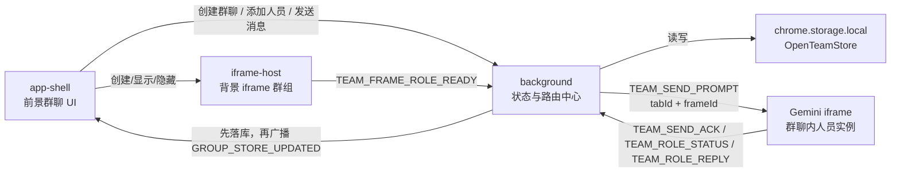
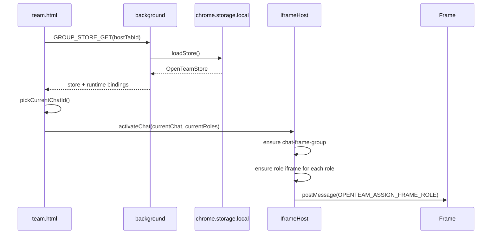
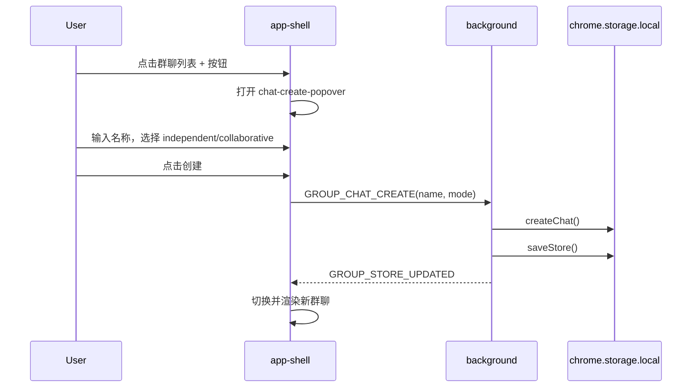
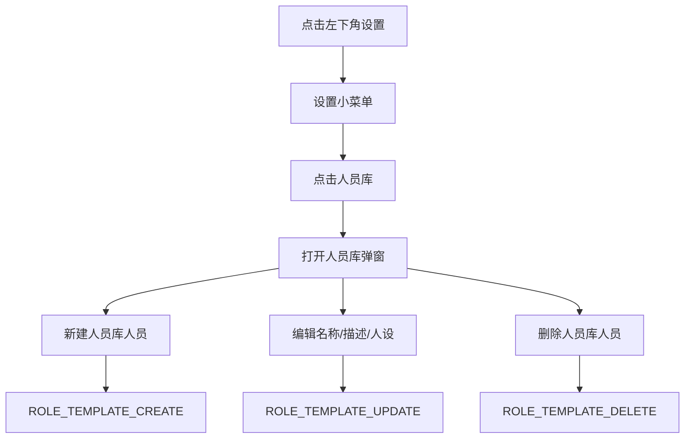
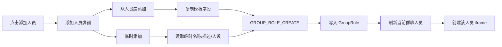
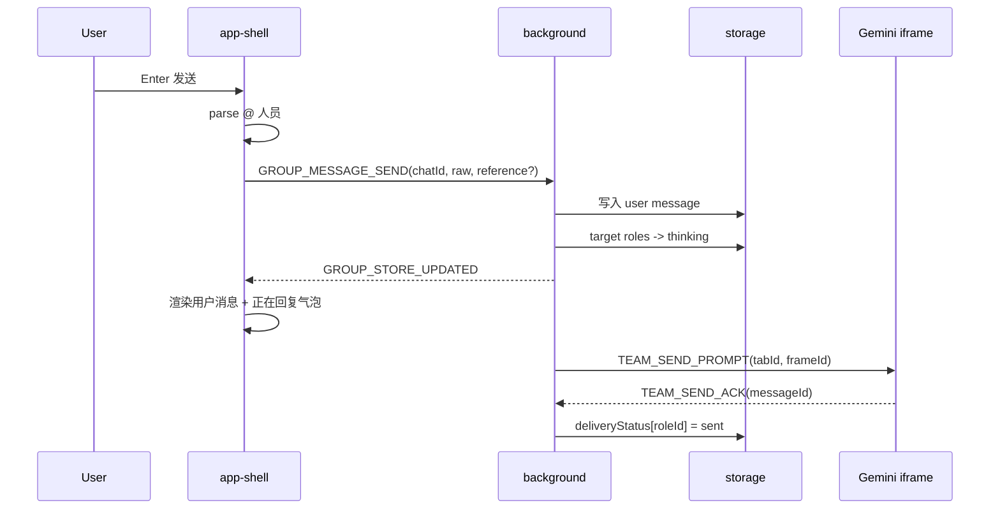
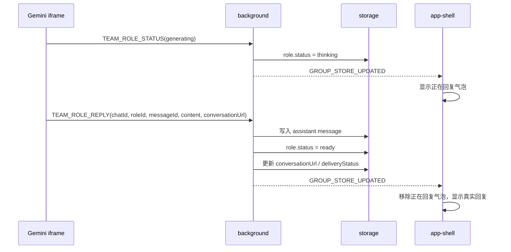
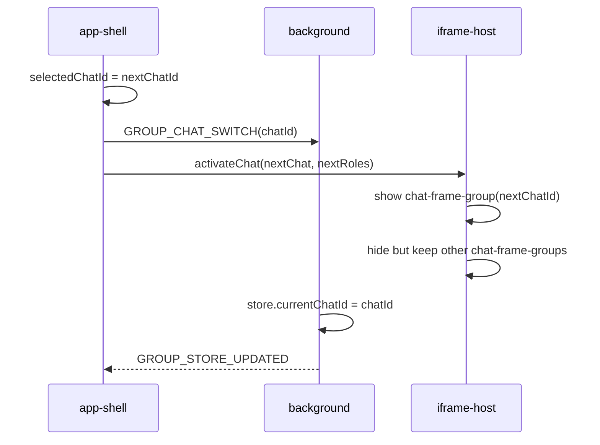
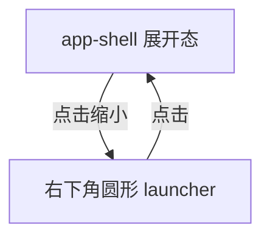

# OpenTeam 群聊体验重构技术方案

## 1. 目标

本文档描述 OpenTeam 群聊体验重构的技术实现方案，对应产品文档：

```text
docs/prd/2026-05-01-group-chat-experience-prd.md
```

本轮技术目标：

- 保持现有本地优先架构，不引入云端服务。
- 在用户可见层统一“人员 / 人员库 / 人设”表达。
- 保持群聊内人员独立身份，不共享 Gemini 会话上下文。
- 支持多个群聊后台并行运行。
- 将 iframe 按群聊分组，并作为 `team.html` 背景层大屏工作区。
- 前景 OpenTeam 聊天窗口只承载群聊 UI，不承载 iframe 卡片。
- 补齐新建群聊模式选择，避免加号直接创建默认“独立专家”群聊。
- 补齐正在回复气泡、Markdown 渲染、输入快捷键、右键改名、右下角缩小态等体验。
- 增加可诊断日志，方便后续测试和定位问题。

## 2. 总体架构

系统继续分为三层：

```text
team.html / team.js
  - 前景 app-shell：群聊列表、消息流、人员摘要、输入框、弹窗
  - 背景 iframe-host：按群聊分组的 Gemini iframe 大屏画布
  - UI 状态：当前显示群聊、弹窗、菜单、右侧人员区展开状态

background service worker
  - chrome.storage.local 读写
  - 群聊 / 人员库 / 群聊内人员 / 消息状态变更
  - runtime frame binding
  - prompt 构造和投递
  - Gemini 回复落库和广播

Gemini iframe content script
  - 接收 chatId + personId 绑定
  - 填入 Gemini prompt 并发送
  - 监听回复
  - 上报回复、状态、会话 URL
```

页面分层：

```text
team.html 页面
├── iframe-host              # 背景层：大屏 iframe 群组画布
│   ├── chat-frame-group(A)
│   ├── chat-frame-group(B)
│   └── chat-frame-group(C)
└── app-shell                # 前景层：OpenTeam 群聊悬浮窗
```

核心数据流：



关键原则：

- `currentChatId` 只代表当前 UI 展示的群聊，不代表唯一运行中的群聊。
- 后台群聊的 iframe 不因切换群聊而销毁。
- 所有人员运行态绑定使用 `chatId + roleId`，UI 文案上称为 `chatId + personId`。
- 回复到达时先写入 store，再广播给 UI。
- 内部类型可保留 `RoleTemplate` / `GroupRole` 命名，避免无收益的大规模重命名；用户可见文案必须改成“人员库 / 人员 / 人设”。

## 3. 现有模型到新产品语言的映射

| 产品语言 | 当前内部类型 | 说明 |
| --- | --- | --- |
| 人员库人员 | `RoleTemplate` | 可复用人设模板，不持有 Gemini 会话 |
| 群聊内人员 | `GroupRole` | 加入群聊后的独立身份，持有独立上下文和会话 URL |
| 人设 | `systemPrompt` | UI 展示为“人设”，内部字段可暂不改名 |
| 群聊人员 | `chat.roleIds -> rolesById` | 某个群聊内的人员实例列表 |
| 人员状态 | `RoleStatus` | UI 显示为待唤醒、加载中、就绪、回复中、异常 |

禁止事项：

- 不要让人员库模板直接持有 `geminiConversationUrl`。
- 不要让两个群聊共享同一个 `GroupRole.id`。
- 不要把同名人员视为同一个运行实体。
- 不要用模板 ID 做消息路由。

## 4. 数据模型

### 4.1 Store 根结构

继续使用：

```ts
interface OpenTeamStore {
  version: number
  currentChatId?: string
  chatOrder: string[]
  chatsById: Record<string, GroupChat>
  rolesById: Record<string, GroupRole>
  messagesById: Record<string, GroupMessage>
  roleTemplateOrder: string[]
  roleTemplatesById: Record<string, RoleTemplate>
  settings: OpenTeamSettings
}
```

本轮建议新增：

```ts
interface GroupChat {
  description?: string
}

interface OpenTeamStore {
  viewState?: OpenTeamViewState
}

interface OpenTeamViewState {
  chatReadSeqById?: Record<string, number>
  collapsedPeoplePanelByChatId?: Record<string, boolean>
}
```

第一版可以只实现 `chatReadSeqById`。右侧人员区默认收起，也可以先不持久化展开状态。

### 4.2 人员库人员

当前沿用：

```ts
interface RoleTemplate {
  id: string
  name: string
  description?: string
  systemPrompt: string
  createdAt: number
  updatedAt: number
}
```

UI 层展示：

```text
name -> 人员名称
description -> 人员描述
systemPrompt -> 人设
```

### 4.3 群聊内人员

当前沿用：

```ts
interface GroupRole {
  id: string
  chatId: string
  templateId?: string
  name: string
  description?: string
  systemPrompt?: string
  status: RoleStatus
  contextCursor: number
  geminiConversationId?: string
  geminiConversationUrl?: string
  lastPromptMessageId?: string
  lastReplyAt?: number
  createdAt: number
  updatedAt: number
}
```

创建规则：

- 从人员库添加：复制 `name / description / systemPrompt` 到新的 `GroupRole`。
- 临时添加：直接创建新的 `GroupRole`，不写入 `roleTemplatesById`。
- 每次加入群聊都生成新的 `roleId`。

### 4.4 消息与正在回复视图

持久化消息继续使用：

```ts
interface GroupMessage {
  id: string
  chatId: string
  seq: number
  type: 'user' | 'assistant' | 'system'
  content: string
  roleId?: string
  roleName?: string
  targetRoleIds?: string[]
  references?: MessageReference[]
  createdAt: number
  status: DeliveryStatus
  deliveryStatus?: Record<string, DeliveryStatus>
}
```

正在回复气泡不建议持久化为真实消息。UI 层从人员状态派生：

```ts
type ThinkingBubble = {
  chatId: string
  roleId: string
  roleName: string
  promptMessageId?: string
}
```

派生条件：

```text
role.status === 'thinking'
&& role.lastPromptMessageId 存在
&& 当前消息流中还没有该 role 对该 promptMessageId 的 assistant 回复
```

## 5. 核心流程

## 5.1 启动与恢复流程



日志点：

- `team-page:boot:start`
- `team-page:store:get`
- `team-page:store:applied`
- `iframe-host:chat-activated`
- `iframe-host:role-created`
- `iframe-host:role-assigned`

## 5.2 新建群聊流程

加号不能直接创建群聊，必须先打开创建面板。



数据要求：

- `mode === 'independent'` 创建独立专家群聊。
- `mode === 'collaborative'` 创建协作群聊。
- 取消创建时不发送 runtime message。

日志点：

- `ui:chat-create-popover:open`
- `ui:chat-create:submit`，字段：`nameLength`、`mode`
- `chat-create:start`
- `chat-create:stored`，字段：`chatId`、`mode`

## 5.3 人员库管理流程



删除规则：

- 删除人员库模板不影响已加入群聊的人员。
- 已加入群聊的人员已经复制了名称、描述、人设。

日志点：

- `ui:settings-menu:open`
- `ui:people-library:open`
- `people-template:create`
- `people-template:update`
- `people-template:delete`

日志注意：

- 不记录完整人设内容。
- 可以记录 `personaLength`。

## 5.4 添加群聊人员流程



从人员库添加 payload：

```ts
{
  type: 'GROUP_ROLE_CREATE',
  chatId,
  roleTemplateId
}
```

临时添加 payload：

```ts
{
  type: 'GROUP_ROLE_CREATE',
  chatId,
  name,
  description,
  systemPrompt
}
```

日志点：

- `ui:person-add-dialog:open`
- `ui:person-add:from-library`
- `ui:person-add:temporary`
- `role-create:start`
- `role-create:stored`
- `iframe-host:role-created`

字段建议：

- `chatId`
- `roleId`
- `templateId`
- `source: 'library' | 'temporary'`
- `personaLength`

## 5.5 消息发送流程



快捷键：

- `Enter`：发送。
- `Command + Enter`：换行。
- `Control + Enter`：换行。
- @ 面板打开时，`Enter` 优先确认当前人员选项。

日志点：

- `ui:message-submit`
- `message-send:start`
- `message-send:parsed-targets`
- `message-send:stored`
- `message-send:deliveries-ready`
- `prompt:send:start`
- `prompt:send:response`
- `send-ack:received`

隐私要求：

- 不记录完整用户消息。
- 记录 `contentLength`、`targetRoleIds`、`hasReference`。

## 5.6 回复接收流程



后台群聊规则：

- 即使 `chatId !== currentChatId`，也必须写入 store。
- UI 收到广播后更新左侧列表状态。
- 当前消息流只渲染当前 `selectedChatId` 的消息。

日志点：

- `role-status:received`
- `role-reply:received`
- `role-reply:stored`
- `group-store-updated:broadcast`
- `ui:background-chat-updated`

字段建议：

- `chatId`
- `roleId`
- `messageId`
- `contentLength`
- `conversationUrlPresent`
- `isActiveChat`

## 5.7 切换群聊流程



关键约束：

- 切换群聊不销毁 iframe。
- 切换群聊不重置非当前群聊人员状态。
- 切换群聊不取消已经发送的 prompt。
- 切换群聊只改变当前消息流、标题、人员摘要和背景 group 可见性。

日志点：

- `ui:chat-switch`
- `chat-switch:stored`
- `iframe-host:chat-visible`
- `iframe-host:chat-hidden`
- `iframe-host:frame-preserved`

## 5.8 iframe 分组流程

目标 DOM：

```text
<div id="iframe-host">
  <section data-chat-frame-group data-chat-id="chat-A">
    <iframe data-chat-id="chat-A" data-role-id="role-1"></iframe>
    <iframe data-chat-id="chat-A" data-role-id="role-2"></iframe>
  </section>
  <section data-chat-frame-group data-chat-id="chat-B" hidden>
    <iframe data-chat-id="chat-B" data-role-id="role-3"></iframe>
  </section>
</div>

<div id="app" class="app-shell">
  ...
</div>
```

`IframeHost` 建议调整：

```ts
class IframeHost {
  private groupsByChatId = new Map<string, HTMLElement>()
  private framesByRoleKey = new Map<`${string}:${string}`, RoleFrameRecord>()

  activateChat(chat, roles) {
    const group = ensureChatGroup(chat.id)
    ensureRoleFrames(chat, roles)
    showGroup(chat.id)
    hideOtherGroups(chat.id)
  }
}
```

可见性策略：

- 当前 group：显示在背景层，可大屏查看。
- 后台 group：`hidden`、弱展示或缩略，由 UI 策略决定；无论哪种都不 remove iframe。
- 缩小聊天窗后，背景层 iframe 工作区仍可操作。

日志点：

- `iframe-host:group-created`
- `iframe-host:group-visible`
- `iframe-host:group-hidden`
- `iframe-host:role-created`
- `iframe-host:role-reused`
- `iframe-host:role-recovered`
- `iframe-host:role-assigned`
- `iframe-host:role-ready`

## 5.9 Markdown 渲染流程

建议新增渲染模块：

```text
src/teamPage/markdown.ts
```

职责：

- 接收原始 `content`。
- 使用 markdown 渲染器生成安全 HTML。
- 禁止危险 HTML 或做安全过滤。
- 给链接加安全属性。
- 输出给消息气泡。

推荐 API：

```ts
export function renderMarkdown(content: string): DocumentFragment
```

安全要求：

- 不直接信任 Gemini 回复内容。
- 不执行 `<script>`。
- 不允许内联事件处理器。
- 链接使用 `rel="noopener noreferrer"`。
- 表格和代码块不能撑破气泡。

日志：

- Markdown 渲染失败时记录 `markdown:render-failed`。
- 只记录 `contentLength` 和错误类型，不记录完整内容。

## 5.10 右下角缩小态流程



实现规则：

- 不再把整个悬浮窗缩成左上角长条。
- 缩小时隐藏 `app-shell` 主体，只显示固定右下角 launcher。
- launcher 显示群聊图标或 OpenTeam 标记。
- 恢复后窗口回到合理位置。

日志点：

- `ui:floating-window:minimize`
- `ui:floating-window:restore`

## 6. 日志设计

## 6.1 日志原则

本轮必须增加更多结构化日志，方便测试和排障。

原则：

- 日志事件名稳定，使用 `domain:action:stage`。
- 日志字段结构化，不拼接长字符串。
- 不记录完整 prompt、完整用户消息、完整 Gemini 回复。
- 内容类字段只记录长度、是否存在、摘要 hash 可选。
- 关键链路 start / success / failed 都要有日志。
- 所有失败日志必须包含 `error`。

建议 logger：

```ts
const log = {
  debug(event: string, details?: Record<string, unknown>): void,
  info(event: string, details?: Record<string, unknown>): void,
  warn(event: string, details?: Record<string, unknown>): void,
  error(event: string, details?: Record<string, unknown>): void,
}
```

## 6.2 必备日志事件

### UI 层

| 事件 | 级别 | 字段 |
| --- | --- | --- |
| `ui:boot:start` | info | `hostTabId` |
| `ui:store:applied` | debug | `chatCount`, `roleCount`, `messageCount`, `currentChatId` |
| `ui:chat-create-popover:open` | debug | 无 |
| `ui:chat-create:submit` | info | `mode`, `nameLength` |
| `ui:chat-switch` | info | `fromChatId`, `toChatId` |
| `ui:message-submit` | info | `chatId`, `rawLength`, `hasReference` |
| `ui:mention-panel:open` | debug | `chatId`, `roleCount` |
| `ui:settings-menu:open` | debug | 无 |
| `ui:people-library:open` | info | `templateCount` |
| `ui:person-add-dialog:open` | info | `chatId`, `source` |
| `ui:floating-window:minimize` | info | `chatId` |
| `ui:floating-window:restore` | info | `chatId` |

### Background 层

| 事件 | 级别 | 字段 |
| --- | --- | --- |
| `store:get` | debug | `hostTabId` |
| `chat-create:start` | info | `mode`, `nameLength` |
| `chat-create:stored` | info | `chatId`, `mode` |
| `chat-update:stored` | info | `chatId`, `patchKeys` |
| `role-template:create` | info | `templateId`, `nameLength`, `personaLength` |
| `role-template:update` | info | `templateId`, `patchKeys`, `personaLength` |
| `role-template:delete` | warn | `templateId` |
| `role-create:start` | info | `chatId`, `source`, `templateId` |
| `role-create:stored` | info | `chatId`, `roleId`, `source` |
| `message-send:start` | info | `chatId`, `rawLength` |
| `message-send:parsed-targets` | debug | `chatId`, `targetRoleIds` |
| `message-send:stored` | info | `chatId`, `messageId`, `targetCount` |
| `prompt:send:start` | info | `chatId`, `roleId`, `messageId`, `tabId`, `frameId`, `contentLength` |
| `prompt:send:response` | debug | `chatId`, `roleId`, `messageId` |
| `prompt:send:failed` | warn | `chatId`, `roleId`, `messageId`, `error` |
| `role-status:received` | debug | `chatId`, `roleId`, `runtimeStatus`, `mappedStatus` |
| `role-reply:received` | info | `chatId`, `roleId`, `messageId`, `contentLength` |
| `role-reply:stored` | info | `chatId`, `roleId`, `replyMessageId` |
| `delivery:error` | warn | `chatId`, `roleId`, `messageId`, `reason` |

### IframeHost 层

| 事件 | 级别 | 字段 |
| --- | --- | --- |
| `iframe-host:group-created` | info | `chatId` |
| `iframe-host:group-visible` | debug | `chatId` |
| `iframe-host:group-hidden` | debug | `chatId` |
| `iframe-host:role-created` | info | `chatId`, `roleId`, `srcKind` |
| `iframe-host:role-reused` | debug | `chatId`, `roleId` |
| `iframe-host:role-assigned` | debug | `chatId`, `roleId`, `attempts` |
| `iframe-host:role-ready` | info | `chatId`, `roleId` |
| `iframe-host:role-recovered` | warn | `chatId`, `roleId` |

### Content script 层

| 事件 | 级别 | 字段 |
| --- | --- | --- |
| `frame-role:assignment-received` | info | `chatId`, `roleId`, `hostTabId`, `conversationIdPresent` |
| `message:send-prompt:start` | info | `chatId`, `roleId`, `messageId`, `contentLength` |
| `message:send-prompt:ack` | debug | `messageId` |
| `message:send-prompt:failed` | warn | `messageId`, `error`, `diagnostics` |
| `reply:accepted` | info | `chatId`, `roleId`, `messageId`, `textLength` |
| `reply:skipped` | debug | `roleId`, `messageId`, `textLength`, `reason` |
| `conversation:update` | debug | `chatId`, `roleId`, `conversationUrlPresent` |

## 7. 模块改造清单

### 7.1 `public/team.html`

职责：

- 补齐创建群聊模式选择面板。
- 增加设置小菜单和人员库弹窗容器。
- 增加添加人员弹窗容器。
- 增加右下角缩小 launcher。
- 保留 `iframe-host` 作为背景层。

注意：

- iframe group 不放进 `app-shell`。
- `app-shell` 在视觉层覆盖 `iframe-host`。

### 7.2 `src/teamPage/index.ts`

职责：

- 管理 UI 状态。
- 新建群聊模式读取。
- 设置菜单和弹窗交互。
- 人员库 CRUD 调用。
- 添加人员弹窗。
- 右侧人员区默认收起。
- 正在回复气泡派生渲染。
- Markdown 渲染接入。
- Enter / Command+Enter / Control+Enter 输入行为。
- 群聊右键改名。

建议拆分：

```text
src/teamPage/index.ts
src/teamPage/markdown.ts
src/teamPage/chatCreate.ts
src/teamPage/peopleLibrary.ts
src/teamPage/contextMenu.ts
src/teamPage/thinkingBubbles.ts
```

第一版可以渐进拆分，不要求一次全部完成。

### 7.3 `src/teamPage/iframeHost.ts`

职责：

- 从平铺 iframe 管理升级为按群聊 group 管理。
- 保持 `chatId + roleId` frame binding。
- 切换群聊时隐藏/显示 group，不销毁 iframe。

核心新增 API：

```ts
getOrCreateChatGroup(chatId: string): HTMLElement
showChatGroup(chatId: string): void
hideChatGroup(chatId: string): void
listChatGroups(): ChatFrameGroupState[]
```

### 7.4 `src/background/index.ts`

职责：

- 新增群聊更新接口，用于重命名和描述更新。
- 保持人员库 CRUD。
- 保持群聊内人员创建逻辑。
- 消息回复到达时无条件按 `chatId` 落库。
- 增加更多日志。

建议新增消息类型：

```ts
GROUP_CHAT_UPDATE
GROUP_CHAT_MARK_READ
```

### 7.5 `src/group/roleTemplates.ts`

职责：

- 保持人员库模板和群聊内人员复制逻辑。
- 临时添加不写入模板库。
- 从人员库添加继续复制字段。

### 7.6 `src/group/types.ts`

可选新增：

```ts
description?: string // GroupChat
viewState?: OpenTeamViewState // OpenTeamStore
```

## 8. 测试计划

### 8.1 单元测试

新增或更新：

- 新建群聊 UI 必须提供模式选择。
- `GROUP_CHAT_CREATE` 使用提交的 mode。
- 从人员库添加会复制为独立 `GroupRole`。
- 临时添加不会创建 `RoleTemplate`。
- 删除人员库模板不影响已加入群聊人员。
- `IframeHost` 切换群聊不销毁 iframe。
- `IframeHost` 按 chat group 管理 DOM。
- 非当前群聊收到回复后写入对应 chat 消息。
- thinking bubble 派生规则。
- Enter / Command+Enter / Control+Enter 行为。
- Markdown 渲染安全过滤。

### 8.2 集成测试

关键路径：

1. 创建协作群聊。
2. 从人员库添加两个人员。
3. 发送消息。
4. 两个人员进入 thinking。
5. 切换到另一个群聊。
6. 原群聊收到回复。
7. 切回原群聊。
8. 能看到后台收到的回复。

### 8.3 手工验证

- 新建群聊时能选择协作模式。
- 右侧人员区默认收起。
- 设置齿轮先打开小菜单，再打开人员库弹窗。
- 添加人员弹窗区分从人员库添加和临时添加。
- iframe 背景层空间足够，不挤在聊天窗里。
- 缩小时变成右下角圆形入口。
- Markdown 代码块、列表、表格不撑破消息气泡。

## 9. 实施顺序

推荐按风险由低到高推进：

1. 新建群聊模式选择修复。
2. 产品文案统一。
3. 设置小菜单 + 人员库弹窗。
4. 添加人员弹窗。
5. 右侧人员区默认收起。
6. 输入框快捷键和 @ 头像首字修复。
7. 正在回复动态气泡。
8. 群聊右键改名。
9. Markdown 渲染。
10. 右下角缩小 launcher。
11. 多群聊未读 / 后台状态提示。
12. iframe 按群聊分组和背景层展示。

第 12 步风险最高，应单独做测试和日志。

## 10. 风险与回滚

### 10.1 iframe 隐藏运行风险

风险：浏览器可能对隐藏 iframe 做节流。

缓解：

- 不销毁 iframe。
- 尽量使用可见但弱展示/缩略的背景 group。
- 增加 `role-status` 和 `reply-timeout` 日志。

### 10.2 Markdown 安全风险

风险：Gemini 回复中可能包含危险 HTML。

缓解：

- 默认禁用 HTML。
- 或接入 sanitizer。
- 对链接添加安全属性。

### 10.3 状态复杂度上升

风险：多群聊后台并行会让 UI 状态和 runtime 状态更复杂。

缓解：

- 严格区分 persisted store、runtime binding、UI view state。
- 增加日志。
- 增加 `chatId`、`roleId`、`messageId` 全链路字段。

### 10.4 文案改造误伤内部逻辑

风险：大规模重命名类型可能引入无意义冲突。

缓解：

- 第一版只改用户可见文案。
- 内部 `RoleTemplate`、`GroupRole` 暂时保留。

## 11. 完成标准

- PRD 中 P0 功能均有实现。
- 新建群聊可选择模式。
- 人员库、添加人员、临时人员行为符合独立身份原则。
- 多群聊后台回复能正确落库。
- iframe group 不在聊天悬浮窗内。
- 关键流程有结构化日志。
- `npm run build` 通过。
- `npm test` 通过。
- 至少覆盖新增核心行为的自动化测试。

